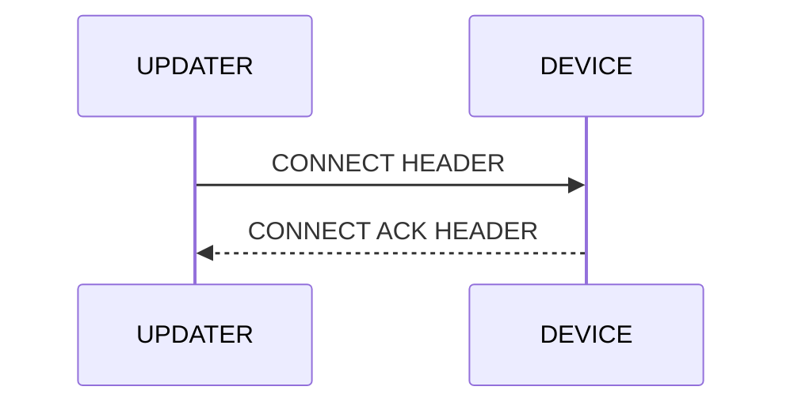

# DUST protocol

## Description

## Packet structure

<table class="tg"><thead>
  <tr>
    <td class="tg-wa1i" rowspan="11">DUST<br>PACKET</td>
    <td class="tg-uzvj" rowspan="4">HEADER<br>(1byte)</td>
    <td class="tg-7btt">OPCODE<br>(2bits)</td>
  </tr>
  <tr>
    <td class="tg-7btt">LENGTH<br>(2bits)</td>
  </tr>
  <tr>
    <td class="tg-7btt">PACKET NUMBER<br>(12bits)</td>
  </tr>
  <tr>
    <td class="tg-7btt">CHECKSUM<br>(16bits)</td>
  </tr>
  <tr>
    <td class="tg-wa1i" rowspan="6">PAYLOAD<br>(32-256bytes)</td>
    <td class="tg-wa1i">DATA[0]</td>
  </tr>
  <tr>
    <td class="tg-wa1i">DATA[1]</td>
  </tr>
  <tr>
    <td class="tg-wa1i">DATA[2]</td>
  </tr>
  <tr>
    <td class="tg-wa1i">...</td>
  </tr>
  <tr>
    <td class="tg-wa1i">DATA[n-1]</td>
  </tr>
  <tr>
    <td class="tg-wa1i">DATA[n]</td>
  </tr>
  <tr>
    <td class="tg-wa1i">CRC16<br>(2bytes)</td>
    <td class="tg-wa1i">CRC</td>
  </tr></thead>
</table>

### OPCODE (2 bits wide)

| OPCODE     | VALUE |
|------------|-------|
| CONNECT    | 0x00  |
| DISCONNECT | 0x01  |
| DATA       | 0x02  |
| ERROR      | 0x03  |

### LENGTH (2 bits wide)

| LENGTH     | VALUE |
|------------|-------|
| BYTE32     | 0x00  |
| BYTE64     | 0x01  |
| BYTE128    | 0x02  |
| BYTE256    | 0x03  |

### ACK (1 bits wide)

| LENGTH     | VALUE |
|------------|-------|
| UNSET      | 0x00  |
| SET        | 0x01  |

### PACKET NUMBER (11 bits wide)

> The packet number is used to enumerate the packets. When error occurs the transmitter is signaled which
> packet was corrupted with the help of this filed.

### CHECKSUM (16 bits wide)

> The checksum purpose is error detection that may have been introduced during header transmission.
>
> Algorithm used to calculate the checksum:
>
> ``` code
> checksum = ((opcode << 0x0e) | (length << 0x0c) | (ack << 0x0b) | (packet_number << 0x00));
> checksum = ~checksum;
> ```

## Connection establishment (handshake)

> The connection establishment sets the payload size for future data packets. In this process only header is sent.
> The receiver calculates the checksum of the header and check it's correctness. It then sends an ACK header.



### CONNECT HEADER

<table class="tg"><thead>
  <tr>
    <td class="tg-uzvj" rowspan="5">DUST<br>PACKET</td>
    <td class="tg-uzvj" rowspan="5">HEADER<br>(4bytes)</td>
    <td class="tg-7btt">0x00<br>(2bits)</td>
  </tr>
  <tr>
    <td class="tg-7btt">0x00<br>(2bits)</td>
  </tr>
  <tr>
    <td class="tg-7btt">0x00<br>(1bit)</td>
  </tr>
  <tr>
    <td class="tg-nrix"><span style="font-weight:bold">0x00</span><br><span style="font-weight:bold">(11bits)</span></td>
  </tr>
  <tr>
    <td class="tg-7btt">0xffff<br>(16bits)</td>
  </tr></thead>
</table>

### CONNECT ACK HEADER

<table class="tg"><thead>
  <tr>
    <td class="tg-uzvj" rowspan="5">DUST<br>PACKET</td>
    <td class="tg-uzvj" rowspan="5">HEADER<br>(4bytes)</td>
    <td class="tg-7btt">0x00<br>(2bits)</td>
  </tr>
  <tr>
    <td class="tg-7btt">0x00<br>(2bits)</td>
  </tr>
  <tr>
    <td class="tg-7btt">0x01<br>(1bit)</td>
  </tr>
  <tr>
    <td class="tg-nrix"><span style="font-weight:bold">0x00</span><br><span style="font-weight:bold">(11bits)</span></td>
  </tr>
  <tr>
    <td class="tg-7btt">0xf7ff<br>(16bits)</td>
  </tr></thead>
</table>