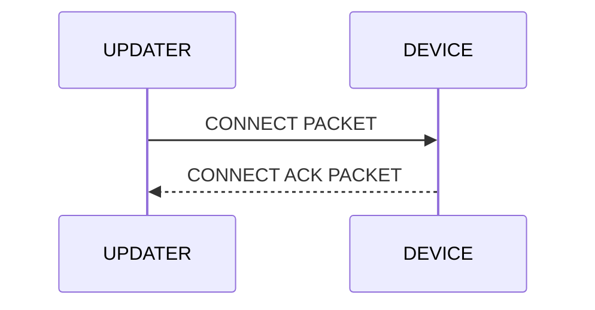

# DUST protocol

## Description

## Packet structure

<table class="tg"><thead>
  <tr>
    <td class="tg-wa1i" rowspan="11">DUST PACKET</td>
    <td class="tg-uzvj" rowspan="4">HEADER (1byte)</td>
    <td class="tg-7btt">OPCODE (2bits)</td>
  </tr>
  <tr>
    <td class="tg-7btt">LENGTH (2bits)</td>
  </tr>
  <tr>
    <td class="tg-7btt">PACKET NUMBER (12bits)</td>
  </tr>
  <tr>
    <td class="tg-7btt">CHECKSUM (16bits)</td>
  </tr>
  <tr>
    <td class="tg-wa1i" rowspan="6">PAYLOAD (32-256bytes)</td>
    <td class="tg-wa1i">DATA[0]</td>
  </tr>
  <tr>
    <td class="tg-wa1i">DATA[1]</td>
  </tr>
  <tr>
    <td class="tg-wa1i">DATA[2]</td>
  </tr>
  <tr>
    <td class="tg-wa1i">...</td>
  </tr>
  <tr>
    <td class="tg-wa1i">DATA[n-1]</td>
  </tr>
  <tr>
    <td class="tg-wa1i">DATA[n]</td>
  </tr>
  <tr>
    <td class="tg-wa1i">CRC16 (2bytes)</td>
    <td class="tg-wa1i">CRC</td>
  </tr></thead>
</table>

### OPCODE (2 bits wide)

| OPCODE     | VALUE |
|------------|-------|
| CONNECT    | 0x00  |
| DISCONNECT | 0x01  |
| DATA       | 0x02  |
| ERROR      | 0x03  |

### LENGTH (2 bits wide)

| LENGTH     | VALUE |
|------------|-------|
| BYTE32     | 0x00  |
| BYTE64     | 0x01  |
| BYTE128    | 0x02  |
| BYTE256    | 0x03  |

### PACKET NUMBER (12 bits wide)

### CHECKSUM (16 bits wide)

## Connection establishment (handshake)

### CONNECT PACKET

<table class="tg"><thead>
  <tr>
    <td class="tg-wa1i" rowspan="11">DUST PACKET</td>
    <td class="tg-uzvj" rowspan="4">HEADER (4bytes)</td>
    <td class="tg-7btt">0x00 (2bits)</td>
  </tr>
  <tr>
    <td class="tg-7btt">0x00 (2bits)</td>
  </tr>
  <tr>
    <td class="tg-7btt">0x00 (12bits)</td>
  </tr>
  <tr>
    <td class="tg-7btt">0xffff (16bits)</td>
  </tr>
  <tr>
    <td class="tg-wa1i" rowspan="6">PAYLOAD (32-256bytes)</td>
    <td class="tg-wa1i">0xcc</td>
  </tr>
  <tr>
    <td class="tg-wa1i">0xcc</td>
  </tr>
  <tr>
    <td class="tg-wa1i">0xcc</td>
  </tr>
  <tr>
    <td class="tg-wa1i">...</td>
  </tr>
  <tr>
    <td class="tg-wa1i">0xcc</td>
  </tr>
  <tr>
    <td class="tg-wa1i">0xcc</td>
  </tr>
  <tr>
    <td class="tg-wa1i">CRC16 (2bytes)</td>
    <td class="tg-wa1i">0x56dd </td>
  </tr></thead>
</table>

### CONNECT ACK PACKET

<table class="tg"><thead>
  <tr>
    <td class="tg-wa1i" rowspan="11">DUST PACKET</td>
    <td class="tg-uzvj" rowspan="4">HEADER (4bytes)</td>
    <td class="tg-7btt">0x00 (2bits)</td>
  </tr>
  <tr>
    <td class="tg-7btt">0x00 (2bits)</td>
  </tr>
  <tr>
    <td class="tg-7btt">0x00 (12bits)</td>
  </tr>
  <tr>
    <td class="tg-7btt">0xffff (16bits)</td>
  </tr>
  <tr>
    <td class="tg-wa1i" rowspan="6">PAYLOAD (32-256bytes)</td>
    <td class="tg-wa1i">0xaa</td>
  </tr>
  <tr>
    <td class="tg-wa1i">0xaa</td>
  </tr>
  <tr>
    <td class="tg-wa1i">0xaa</td>
  </tr>
  <tr>
    <td class="tg-wa1i">...</td>
  </tr>
  <tr>
    <td class="tg-wa1i">0xaa</td>
  </tr>
  <tr>
    <td class="tg-wa1i">0xaa</td>
  </tr>
  <tr>
    <td class="tg-wa1i">CRC16 (2bytes)</td>
    <td class="tg-wa1i">0xa17f </td>
  </tr></thead>
</table>