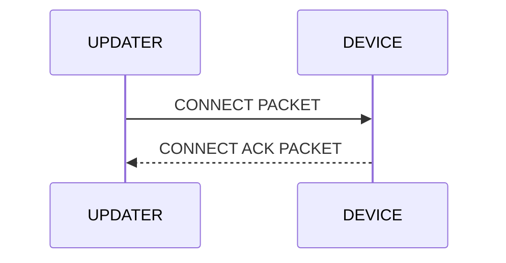

# DUST protocol

## Description

## Protocol structures


## Packet structure

> <table class="tg"><thead>
>   <tr>
>     <td class="tg-uzvj" rowspan="12">DUST<br>PACKET</td>
>     <td class="tg-uzvj" rowspan="5">HEADER<br>(4bytes)</td>
>     <td class="tg-7btt">OPCODE<br>(2bits)</td>
>   </tr>
>   <tr>
>     <td class="tg-7btt">LENGTH<br>(2bits)</td>
>   </tr>
>   <tr>
>     <td class="tg-7btt">ACK FLAG<br>(1bit)</td>
>   </tr>
>   <tr>
>     <td class="tg-7btt">PACKET NUMBER<br>(11bits)</td>
>   </tr>
>   <tr>
>     <td class="tg-7btt">CHECKSUM<br>(16bits)</td>
>   </tr>
>   <tr>
>     <td class="tg-uzvj" rowspan="6">PAYLOAD<br>(32-256bytes)</td>
>     <td class="tg-uzvj">DATA[0]</td>
>   </tr>
>   <tr>
>     <td class="tg-uzvj">DATA[1]</td>
>   </tr>
>   <tr>
>     <td class="tg-uzvj">DATA[3]</td>
>   </tr>
>   <tr>
>     <td class="tg-uzvj">...</td>
>   </tr>
>   <tr>
>     <td class="tg-uzvj">DATA[n-1]</td>
>   </tr>
>   <tr>
>     <td class="tg-uzvj">DATA[n]</td>
>   </tr>
>   <tr>
>     <td class="tg-uzvj">CRC16<br>(2bytes)</td>
>     <td class="tg-uzvj">CRC16<br></td>
>   </tr></thead></table>

### OPCODE (2 bits wide)

> | OPCODE     | VALUE |
> |------------|-------|
> | CONNECT    | 0x00  |
> | DISCONNECT | 0x01  |
> | DATA       | 0x02  |
> | ERROR      | 0x03  |
>
> ### LENGTH (2 bits wide)
>
> | LENGTH     | VALUE |
> |------------|-------|
> | BYTE32     | 0x00  |
> | BYTE64     | 0x01  |
> | BYTE128    | 0x02  |
> | BYTE256    | 0x03  |
>
> ### ACK (1 bits wide)
>
> | LENGTH     | VALUE |
> |------------|-------|
> | UNSET      | 0x00  |
> | SET        | 0x01  |

### PACKET NUMBER (11 bits wide)

> The packet number is used to enumerate the packets. When error occurs the transmitter is signaled which
> packet was corrupted with the help of this filed.

### CHECKSUM (16 bits wide)

> The checksum purpose is error detection that may have been introduced during header transmission.
>
> Algorithm used to calculate the checksum:
>
> ``` code
> checksum = ((opcode << 0x0e) | (length << 0x0c) | (ack << 0x0b) | (packet_number << 0x00));
> checksum = ~checksum;
> ```

### HANDSHAKE OPTIONS

> Handshake options are send in payload when a connection attempt is made.
> The first byte stores information about ACK packet frequency (rate), the next four bytes have information about number of packets.

## Connection establishment (handshake)

> The connection establishment sets the payload size for future data packets. In this process only header is sent.
> The receiver calculates the checksum of the header and check it's correctness. It then sends an ACK header.



### CONNECT PACKET

> <table class="tg"><thead>
>   <tr>
>     <td class="tg-uzvj" rowspan="12">DUST<br>PACKET</td>
>     <td class="tg-uzvj" rowspan="5">HEADER<br>(4bytes)</td>
>     <td class="tg-7btt">0x00<br>(2bits)</td>
>   </tr>
>   <tr>
>     <td class="tg-7btt">0x00<br>(2bits)</td>
>   </tr>
>   <tr>
>     <td class="tg-7btt">0x00<br>(1bit)</td>
>   </tr>
>   <tr>
>     <td class="tg-7btt">0x00<br>(11bits)</td>
>   </tr>
>   <tr>
>     <td class="tg-7btt">0xffff<br>(16bits)</td>
>   </tr>
>   <tr>
>     <td class="tg-uzvj" rowspan="6">PAYLOAD<br>(32-256bytes)</td>
>     <td class="tg-uzvj">0x00</td>
>   </tr>
>   <tr>
>     <td class="tg-uzvj">0x00</td>
>   </tr>
>   <tr>
>     <td class="tg-uzvj">0x00</td>
>   </tr>
>   <tr>
>     <td class="tg-uzvj">...</td>
>   </tr>
>   <tr>
>     <td class="tg-uzvj">0x00</td>
>   </tr>
>   <tr>
>     <td class="tg-uzvj">0x00</td>
>   </tr>
>   <tr>
>     <td class="tg-uzvj">CRC16<br>(2bytes)</td>
>     <td class="tg-uzvj">0xa9b8<br></td>
>   </tr></thead>
> </table>

### CONNECT ACK PACKET

> <table class="tg"><thead>
>   <tr>
>     <td class="tg-uzvj" rowspan="12">DUST<br>PACKET</td>
>     <td class="tg-uzvj" rowspan="5">HEADER<br>(4bytes)</td>
>     <td class="tg-7btt">0x00<br>(2bits)</td>
>   </tr>
>   <tr>
>     <td class="tg-7btt">0x00<br>(2bits)</td>
>   </tr>
>   <tr>
>     <td class="tg-7btt">0x01<br>(1bit)</td>
>   </tr>
>   <tr>
>     <td class="tg-7btt">0x00<br>(11bits)</td>
>   </tr>
>   <tr>
>     <td class="tg-7btt">0xffff<br>(16bits)</td>
>   </tr>
>   <tr>
>     <td class="tg-uzvj" rowspan="6">PAYLOAD<br>(32-256bytes)</td>
>     <td class="tg-uzvj">0x00</td>
>   </tr>
>   <tr>
>     <td class="tg-uzvj">0x00</td>
>   </tr>
>   <tr>
>     <td class="tg-uzvj">0x00</td>
>   </tr>
>   <tr>
>     <td class="tg-uzvj">...</td>
>   </tr>
>   <tr>
>     <td class="tg-uzvj">0x00</td>
>   </tr>
>   <tr>
>     <td class="tg-uzvj">0x00</td>
>   </tr>
>   <tr>
>     <td class="tg-uzvj">CRC16<br>(2bytes)</td>
>     <td class="tg-uzvj">0x3508<br></td>
>   </tr></thead>
> </table>

## Data transmission

> During data transmission, firmware bytes are sent in the payload.
> The rate of ACK packets depends on the options passed during the handshake.

 ```mermaid
 sequenceDiagram
     UPDATER->>DEVICE: DATA[0] PACKET
     UPDATER->>DEVICE: DATA[1] PACKET
     UPDATER->>DEVICE: DATA[2] PACKET
     UPDATER->>DEVICE: ...
     UPDATER->>DEVICE: DATA[n] PACKET
     DEVICE-->>UPDATER: DATA ACK PACKET
     UPDATER->>DEVICE: DATA[n+1] PACKET
     UPDATER->>DEVICE: ...
 ```

## Disconnection

> Disconnection is performed from slave side. The device that updates itself
> sends the disconnection packet after the last data is received.

 ```mermaid
 sequenceDiagram
     DEVICE-->>UPDATER: DISCONNECTION PACKET
     UPDATER->>DEVICE: DISCONNECTION PACKET ACK
 ```

### DISCONNECTION PACKET

> <table class="tg"><thead>
>   <tr>
>     <td class="tg-uzvj" rowspan="12">DUST<br>PACKET</td>
>     <td class="tg-uzvj" rowspan="5">HEADER<br>(4bytes)</td>
>     <td class="tg-c3ow">0x01</td>
>   </tr>
>   <tr>
>     <td class="tg-c3ow">0x00</td>
>   </tr>
>   <tr>
>     <td class="tg-c3ow">0x00</td>
>   </tr>
>   <tr>
>     <td class="tg-9wq8">0x00</td>
>   </tr>
>   <tr>
>     <td class="tg-c3ow">0xbfff</td>
>   </tr>
>   <tr>
>     <td class="tg-uzvj" rowspan="6">PAYLOAD<br>(32-256bytes)</td>
>     <td class="tg-9wq8">0x00</td>
>   </tr>
>   <tr>
>     <td class="tg-9wq8">0x00</td>
>   </tr>
>   <tr>
>     <td class="tg-9wq8"><span style="font-style:normal">0x00</span></td>
>   </tr>
>   <tr>
>     <td class="tg-9wq8">...</td>
>   </tr>
>   <tr>
>     <td class="tg-9wq8"><span style="font-style:normal">0x00</span></td>
>   </tr>
>   <tr>
>     <td class="tg-9wq8"><span style="font-style:normal">0x00</span></td>
>   </tr>
>   <tr>
>     <td class="tg-uzvj">CRC16<br>(2bytes)</td>
>     <td class="tg-9wq8">0x0577</td>
>   </tr></thead>
> </table>